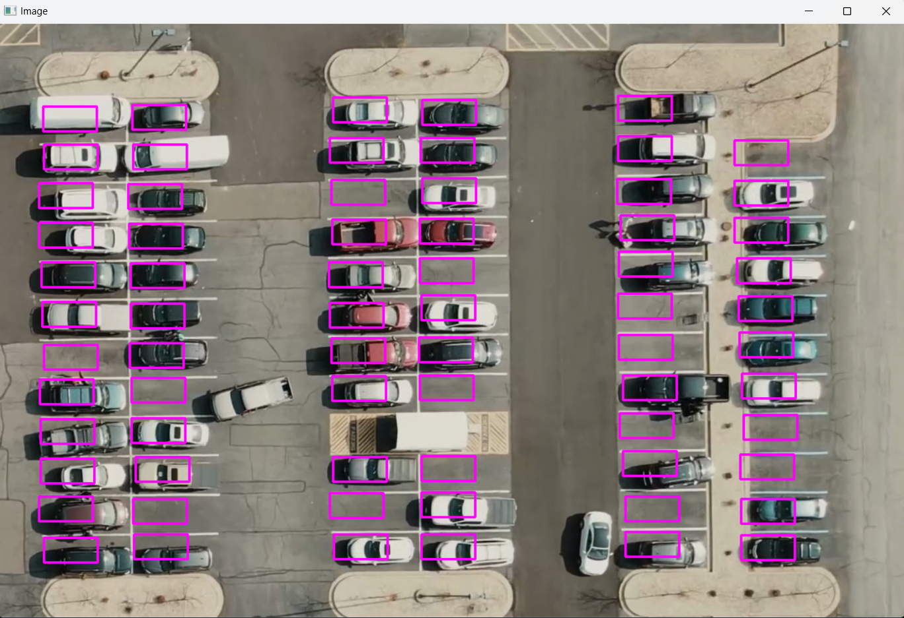
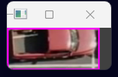
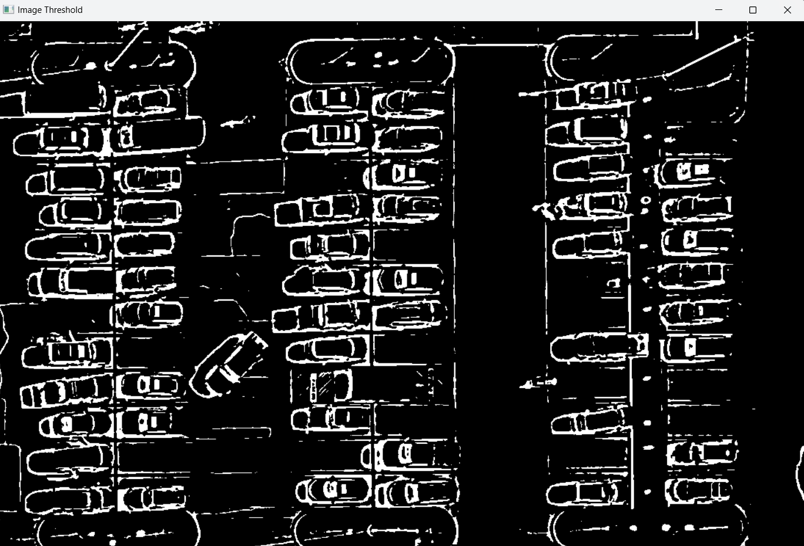
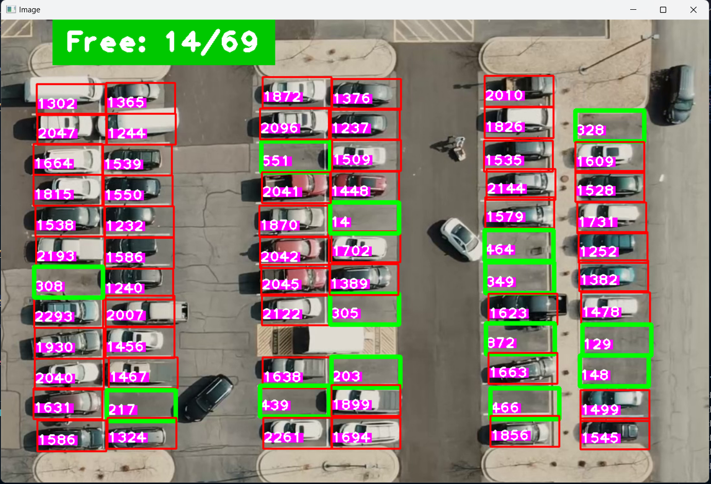

# Smart Parking Management System

A real-time parking slot detection and monitoring system powered by computer vision. Detects occupancy across 60+ slots and streams live availability updates to an interactive web dashboard.

🔗 **[View Demo Video](https://github.com/AayushSomvanshi/Smart-Parking-Management-System/blob/main/carPark.mp4)**

---

## ✨ Features

- 📷 Real-time video feed analysis using OpenCV
- 🟩 Detects 60+ parking slots across multiple zones simultaneously
- ⚡ Live slot availability streamed to dashboard via Flask-SocketIO (low latency)
- 🖱️ Manual slot selection tool — define custom parking zones for any lot
- 📊 Interactive dashboard showing per-zone occupancy count in real time
- 🔄 Automatic green/red slot marking — green = free, red = occupied

---

## 🛠️ Tech Stack

| Layer | Technology |
|---|---|
| Computer Vision | Python, OpenCV, CVZone |
| Backend | Flask, Flask-SocketIO |
| Frontend | HTML, CSS, JavaScript |
| Data | Pixel-based occupancy detection |

---

## ⚙️ How It Works

1. **Frame Capture** — Video feed is processed frame by frame
2. **Preprocessing** — Each frame is converted to grayscale → blurred → thresholded → dilated
3. **Slot Analysis** — White pixel count within each defined slot region is measured
   - Pixels **< 900** → slot is **empty** 🟩
   - Pixels **≥ 900** → slot is **occupied** 🟥
4. **Live Streaming** — Results are emitted via SocketIO to the web dashboard in real time
5. **Dashboard Update** — Slot grid updates instantly without page reload

---

## 📸 Screenshots

### Parking Space Selection


### Live Detection — Empty vs Occupied


### Pixel Analysis (Thresholded View)


### Final Output — Green/Red Slot Marking


---

## 🚀 Getting Started

### Prerequisites

```bash
pip install opencv-python
pip install cvzone
pip install numpy
pip install flask
pip install flask-socketio
```

### Installation

```bash
# Clone the repository
git clone https://github.com/AayushSomvanshi/Smart-Parking-Management-System.git
cd Smart-Parking-Management-System

# Install dependencies
pip install opencv-python cvzone numpy flask flask-socketio

# Run the app
python app.py
```

Then open: `http://127.0.0.1:5000`

### Define Your Own Parking Slots

Run the slot picker tool to manually select parking zones on your own video feed:

```bash
python app1.py
```

Click to add slots, right-click to remove. Slot positions are saved to `CarParkPos` automatically.

---

## 📁 Project Structure

```
Smart-Parking-Management-System/
│
├── app.py              # Main Flask + SocketIO server
├── app1.py             # Parking slot picker utility
├── CarParkPos          # Saved slot positions (binary)
├── carPark.mp4         # Sample parking lot video
├── img.jpeg            # Reference image for slot picker
│
├── templates/
│   └── index.html      # Dashboard UI
│
└── readme-images/      # Screenshots for documentation
```

---

## 👨‍💻 Author

**Aayush Somvanshi**
[](https://github.com/AayushSomvanshi)
[](mailto:aayush26som@gmail.com)
 
